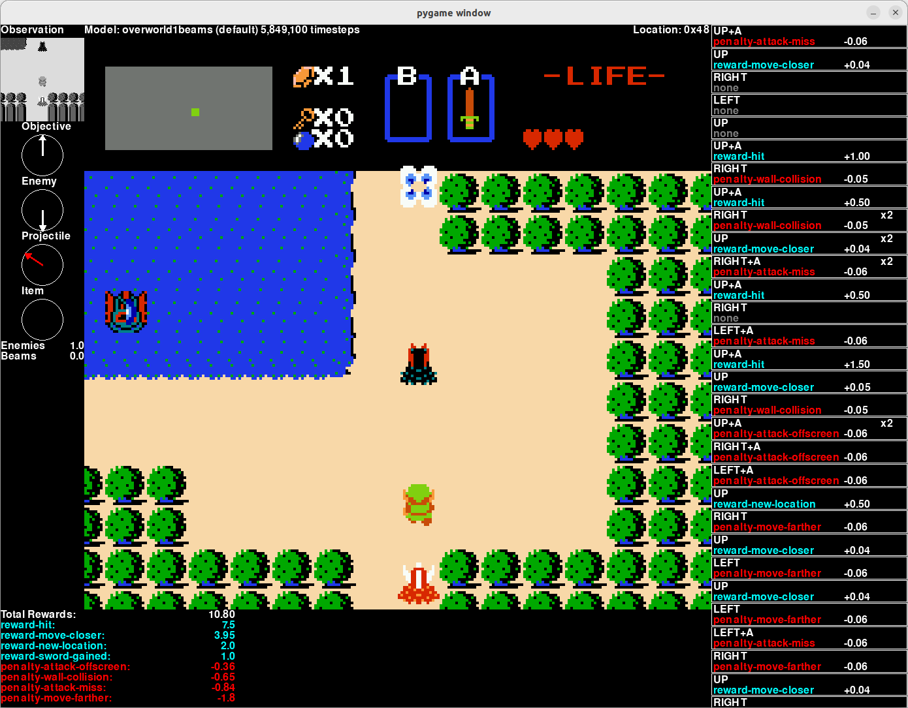

# Triforce - a deep learning agent for The Legend of Zelda (nes)

This repo contains code to train neural networks to play The Legend of Zelda.  It also includes some pretrained models that can play the game from the start through the end of the first dungeon (though often it doesn't play as well as I might hope).

## Getting Started

This repo does *not* include a copy of the Legend of Zelda rom.  You must find your own copy of the rom and place it (uncompressed) at `triforce/custom_integrations/Zelda-NES/rom.nes`.

This project was built using Python 3.10 on Ubuntu.  You may also have to install `libgl1-mesa-glx` to use `run.py`.

This repo does include a set of pre-trained models.  Once the Zelda rom is in place, simply run `./run.py` to see the model play the game up through the end of the first dungeon.  (It does not usually win.)

## Architecture

This project uses stable-baselines3 for reinforcement learning (specifically PPO) and neural networks, stable-retro to provide NES emulation, and pygame to render the game when debugging rewards and models.

Instead of one model that does everything, this project uses a series of models trained on specific tasks to play the game.  We still try to limit the overall number of models used to what we really need.

The triforce project itself is divided into some key areas:

* Zelda Gymnasium Environments and Wrappers - Used to transform the Zelda game state into something a machine-learning model can understand.
* Zelda Memory/Game Interpretation - Code to pull apart the game's RAM and interpret it.
* Objective Selector - Selects what the model *should* be doing at any given time.
* Critics and End Conditions - Used to reward the reinforcement learning algorithm based on the current objective.
* Scenarios and Models - We define a set of models and a set of scenarios to train them.

### Gymnasium Environments and Wrappers

[make_zelda_env](triforce/zelda_env.py) is a function which creates a Zelda retro environment with all the appropriate wrappers.  Most uses of stable-retro are confined to this one file/function (with some exceptions where it made sense).

[ScenarioWrapper](triforce/scenario_wrapper.py) keeps track of the scenario we are running or training on, and all of the critics and end conditions associated with it.

[ZeldaActionSpace](triforce/action_space.py) sets the allowed action space.  Zelda doesn't allow you to press all buttons a the same time to do anything meaningful, so we reduce the action space down to specific actions which can be taken at the given moment in game.

[ZeldaObservationWrapper](triforce/zelda_observation_wrapper.py) controls what the model "sees" in terms of the image.  It was clear from early on that the basic neural networks defined by stable-baselines3 could not interpret the entire view of the game.  It's too hard for it to find link on the screen and interpret enemies around him.  Instead we create a viewport around link, so the model always has link centered in its view.  We also convert to grayscale because (so far) it seems the model plays better with less color channels to interpret.

[ZeldaVectorFeatures](triforce/zelda_vector_features.py) provides a few more observations to the model.  Since we don't give the model the view of the entire screen (or the hud, including link's health), it isn't able to "see" enemies, items, and objectives outside of that viewport.  Instead, we provide it with some limited data to help it know about things outside of its view.  This includes whether link has full health to shoot sword beams, vectors pointing to the nearest enemy, item, projectile, and the objective.  The goal is to give the model enough to play the game with a small viewport, but not enough to feel like it's 'cheating'.

[zelda_game.py](triforce/zelda_game.py) does a lot of the nitty gritty of interpreting raw RAM state into something more usable.  This produces `ZeldaGameState`, which contains properties for `Link`, enemies on screen (`Enemy`), and projectiles (`Projectile`).

[ZeldaGameWrapper](triforce/zelda_wrapper.py) is the base wrapper around the Zelda environment.  It produces `info['state']` and `info['gamestate']` which are used to interpret what is going on within the game.

[Objectives](triforce/objectives.py) sets the current goal of the model.  The objective selector starts with some game knowledge required to make progress in the game (such as which rooms contain treasure if you kill all enemies, what the coordinates of each dungeon are on the world map).  This is similar to if you were playing the game with a game guide, as that's how I chose to build an AI to tackle this game.  It does not know what each room looks like or how rooms connect together, only the locations of items and dungeons.  From that basic information, it will slowly build up state over the course of a single run (which is wiped out on reset).  The class will select a goal which is an enum of what link should do {MoveNorth, MoveSouth, FightEnemies, CollectTreasure, etc} and a list of tiles that those objectives live on.  This is all local to the current screen that link is on.

### Critics and End Conditions

[ZeldaCritic](triforce/critics.py) classes define rewards.  Scenarios have exactly one critic associated with them, and that is used to reward the model for good gameplay and discourage it from bad gameplay.  This is implemented by giving the critics the game state prior to an action it took, the game state after that action, and it fills in a dictionary of rewards.  We use a reward dictionary (not just a number) so that we can debug rewards to figure out issues with training.

Critics also define a **`score`** that is separate from rewards.  Where rewards are all about how well the model is *playing the game*, and are used to train the model, the `score` is used to determine how well the model is *completing the scenario*.  In particular, the score counts things like health lost and how far the model progressed through rooms.   We don't use score when training the model.  Instead, score is used during evaluation to make sure the model doesn't just get a high reward value but die in the first room or two.

[ZeldaEndCondition](triforce/end_conditions.py) classes track when the scenario is won, lost, or should be truncated (if the AI gets stuck in one place, for example).  Scenarios have multiple end conditions.

### Scenarios and Models

[triforce.json](triforce/triforce.json) this *defines* models and the scenarios used to train and evaluate them (definitions are in [models_and_scenarios.py](triforce/models_and_scenarios.py)).

Models define what their action space is (for example, basic combat models do not use items like bombs, so the B button is entirely disabled for them.)  They define their training scenario and how many iterations should be used by default to train them.  Models also define a series of conditions and a priority for selecting them.  This project uses multiple models to play the game, so each model defines the equipment needed to use it (beams, bombs, etc) and the level that the model should be used (dungeon1, overworld, etc).  Lastly, it also defines a priority.  When multiple models match the criteria, priority determines which is picked.

Scenarios are used to train and evaluate models.  They define what critic, end conditions, and starting room(s) are used to train them.  They also allow us to change aspects of gameplay.  The `data` section can change RAM values of the game to do a variety of things.  The `fixed` section is like `data` but those values are reset every frame.  This is how we train the model which knows how to use sword beams.  No matter if that model takes damage, it is always set to full health.  For the no-beam model, we always set health lower than full so that it never has sword beams when training.

[machine_learning.py](triforce/machine_learning.py) encompasses all neural network and reinforcement learning algorithms.  Currently, this project simply uses stable-baselines for its PPO implementation along with the default 'MultiInputPolicy'.  All interaction with the model goes through the ZeldaAI class to train it, predict actions, and load/save the model itself.  This allows you to easily swap out the underlying implementation without touching the rest of the project.

## Running and Debugging the Models

I develop on Linux, but in the past this project has worked fine on an up-to-date WSL2 Ubuntu 22 instance on Windows (the pygame based GUI also works).  I do not test on Windows though, so your experience may vary if I've accidently broken something.

Be sure to install dependencies with `pip install -r requirements.txt`.

Be sure to place The Legend of Zelda rom at `triforce/custom_integrations/Zelda-NES/rom.nes`.

### Running and Debugging Scenarios

This repo includes a set of pre-trained models.  To run the full game simply use `run.py`.  By default it will run the full game, but you can specify a scenario with the first argument (e.g. `run.py dungeon1beams`).  You can specify the `--model-path` to be a location other than the checked in models, which is helpful to do after training (e.g. `run.py --model-path training/`).

    ./run.py
    ./run.py overworld1beams
    ./run.py overworld1nobeams --model-path training/

Keybindings for `run.py`:

* **u** - Uncap frame rate to make the game (hopefully) run faster.
* **q** - Quit.
* **p** - Pause.
* **c** - Continue (unpause).
* **n** - Run the next step.
* **o** - Show tile/pathfinding overlay
* **m** - Change between models.  Useful when pointing at a training directory.
* **F4** - Enable recording.  Recording files are dropped to recording/
* **F10** - Enable in-memory recording, only saving the recording if the scenario is successfully completed.  **DANGER**: This can eat 100gb+ of RAM.  I use this to capture videos of successful runs, but should not be used unless your machine has a massive amount of RAM.

As the program runs, per-step rewards are displayed on the right hand side.  Clicking on those individual rewards will cause the program to re-run the ZeldaCritic responsible for generating that reward and will print the values to the console.  This is used to debug rewards.  When you see a reward that doesn't make sense, use VS Code (or your favorite editor/debugger) to set a breakpoint on the function and click the reward in the UI to debug through it.

### Training Models

Training the model can be accomplished using `train.py`.  By default it will train all models, single-threaded, using the default number of iterations defined in `triforce.json`.  You can also specify which models to train, where to output the models, how many subprocesses to use, etc.

    ./train.py
    ./train.py overworld1beams overworld1nobeams
    ./train.py overworld1beams overworld1nobeams --iterations 7500000
    ./train.py overworld1beams overworld1nobeams --iterations 7500000 --parallel 8
    ./train.py overworld1beams overworld1nobeams --iterations 7500000 --parallel 8 --output ~/new_models/

By default, the new models will be placed in `training/`. Use `run.py --model-path training/` to test the new models.

### Evaluating Models

Rewards teach the model how to play, but it's the scoring function that tries to figure out how well the model is doing in completing the scenario.  It doesn't matter how many enemies Link kills or movements in the "wrong" direction as long as he completes the scenario without dying.  The `evaluate.py` module will run a given scenario 100 times (by default) and calculate the percentage of runs that were completed successfully, as well as the average score and rewards.

After completing a training run, you should use `evaluate.py` and compare it to `models/evaluation.csv`.  You can run this in parallel (but it's graphics card RAM intensive, so keep the number low), and the number of episodes to run.  For example, if you trained the dungeon1beams and dungeon1nobeams models and saved them to the default training/ folder:

    usage: evaluate.py model-path scenarios

    ./evaluate.py training/ dungeon1beams dungeon1nobeams
    ./evaluate.py training/ dungeon1beams dungeon1nobeams --parallel 4
    ./evaluate.py training/ dungeon1beams dungeon1nobeams --episodes 250 --parallel 4

## Contributing

Contributions to this repo are more than welcome, just submit a pull request. If you are making large edits or changes that are more than just a bugfix or tweak, feel free to open an issue to discuss beforehand. That will make sure that a giant change won't be rejected after you get through it.

When submitting a PR, please be sure to run `pylint *py triforce/` and clean up/silence any errors.  It's ok if functions are slightly too long, have too many if statements, etc.  If it's possible to follow the pylint rules reasonably, please do so, if not then just make sure you aren't adding any new warnings.

If your change modifies how the model is rewarded (e.g. any modifications to [critics.py](triforce/critics.py)), please include the output of `evaluate.py` on a newly trained model with those changes, even if we aren't updating the checked in model.

You are also more than welcome to fork this project and take it in your own direction.  Have fun!
